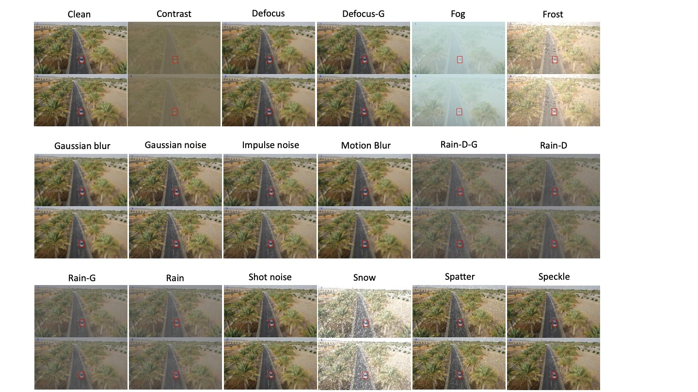

# Benchmarking the Robustness of UAV Tracking Against Common Corruptions

## Introduction
Unmanned Aerial Vehicle (UAV) tracking has become an essential technology in various applications ranging from surveillance to delivery services. However, UAVs often operate in dynamic and challenging environments that can degrade the performance of tracking algorithms. This repository presents a comprehensive benchmark for evaluating the robustness of UAV tracking algorithms against common visual corruptions.



## Dataset
The benchmark dataset includes sequences of UAV footage subjected to a variety of synthetic corruptions, replicating real-world scenarios where visual quality might be compromised. Corruptions include following categories:
- Weather
- Sensor
- Blur
- Composite

Each specific corruption type has 3 levels of severity to simulate varying conditions.

## Getting Started
To evaluate your UAV tracking algorithm with this benchmark, follow the steps below:

1. **Clone the Repository**
2. **Install Dependencies**
- Install the required Python packages:
  ```
  pip install -r requirements.txt
  ```

3. **Prepare the Dataset**
- Download the dataset from the [releases page](https://github.com/your-username/uav-tracking-corruption-benchmark/releases).
- Extract the dataset into the `data/` directory.

